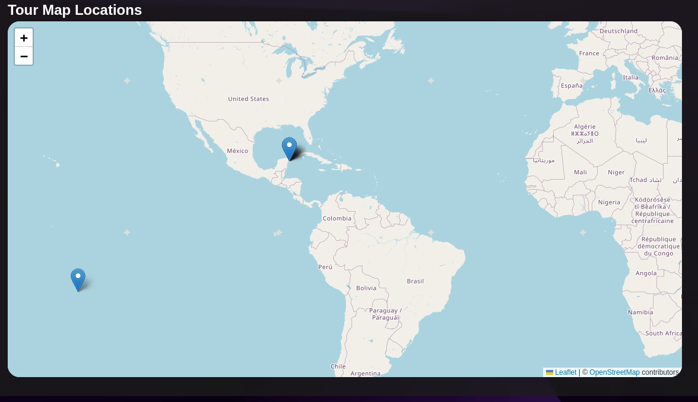

# Groupie Tracker - Geolocolization

## Project Description
The Geolocalization project utilizes OpenStreetMap and Leaflet.js to provide an interactive mapping experience. It enables users to visualize and interact with geographic locations dynamically, making it useful for applications that require location tracking and mapping.

### Key Features
1. **Interactive Map Integration:**

  - Displays locations dynamically on an interactive map using Leaflet.js.

  - Supports zooming, panning, and marker placement.

2. **Location Search:**

 - Users can search for locations by name.

 - The application fetches coordinates from the OpenStreetMap API (Nominatim) to place markers on the map.

3. **Automatic Marker Placement:**

 - Extracts location names from HTML elements (e.g., event listings or tour dates).

 - Fetches coordinates dynamically and places markers with popups showing location names.

### Technology and Approach
- The application integrates Leaflet.js for rendering interactive maps.
-  OpenStreetMap API (Nominatim) is used to fetch location coordinates dynamically.
-  JavaScript is utilized to parse location data and update the map in real-time.
-  The UI is designed to be simple and responsive for easy interaction.

## Repository
The code for this project is available on GitHub:
[Geolocolization](https://github.com/nyagooh/geolocalization.git)

## Collaborators
- [**Nyagooh Maina**](https://www.linkedin.com/in/maina-anne-37797820b/)
- [**Kevin Wasonga**](https://www.linkedin.com/in/kevin-wasonga-3a9050317/)
- [**Granton Onyango**](https://www.linkedin.com/in/granton-onyango-298ba6213/)

## Usage
1. **Clone the Repository**:
   ```bash
   git clone https://github.com/nyagooh/geolocalization.git
   ```

2. **Navigate to the Project Directory**:
   ```bash
   cd GEOLOCALIZATION
   ```

3. **Run the Server**:
   Ensure you have Go installed on your system, then execute:
   ```bash
   go run main.go
   ```

4. **Access the Application**:
   Open your browser and navigate to:
   ```
   http://localhost:8080
   ```

## Example use

## Contributions
We welcome contributions to the project. To contribute:
1. Fork the repository.
2. Create a feature branch: `git checkout -b feature-name`.
3. Commit your changes: `git commit -m "Description of changes"`.
4. Push the branch: `git push origin feature-name`.
5. Open a pull request.

## Feedback
We encourage feedback and suggestions. Feel free to open an issue or contact any of the collaborators directly.

## License
This project is open source and distributed under the GNU General Public License v3.0. For more details, see the [LICENSE](LICENSE) file.


